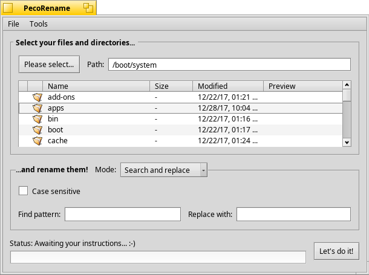

PecoRename
------------

PecoRename is a powerful renaming utility, which allows you to rename many files according to a preset pattern. See the [ReadMe](https://rawgit.com/HaikuArchives/PecoRename/master/Docs/ReadMe.html) for more information.

Rename Modes
------------

PecoRename can rename the files using the following modes:
* Search and replace
* Insert / overwrite
* Random symbols
* Remove
* Numbering
* Add file extension
* Uppercase / lowercase
